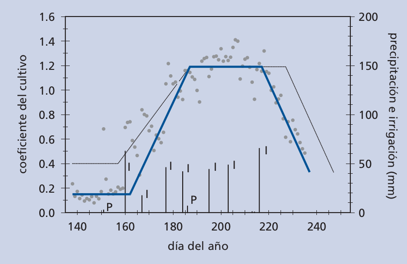

+++

# Resumen
Este cuaderno digital interactivo tiene como objetivo demostrar las relaciones entre la estructura de la vegetación, el transporte convectivo de calor y la temperatura de la superficie.

Para ello haremos uso de modelos de combinación de energía, tanto el modelo tipo "big leaf" de Penman-Monteith como el modelo de dos capas de Shuttleworth-Wallace.

La aplicación más conocida del modelo de Penman-Moteith es la ecuación de la ET de referencia de FAO. La cual calcula la evapotranspiración que tendría un cultivo de referencia. Este cultivo de referencia se establece como una capa de césped que cubre el terreno completamente, recortada a 12 cm y sin limitaciones hídricas en el suelo.

+++

# Instrucciones
Lee con detenimiento todo el texto, y sigue sus instrucciones.

Una vez leida cada sección de texto ejecuta la celda de código siguiente (marcada como `In []`) presionando el icono de `Run`/`Ejecutar` o presionando en el teclado ALT + ENTER. Aparecerá una interfaz gráfica con la que poder realizar las tareas asignadas.

Como ejemplo ejectuta la siguiente celda para importar todas  las librerías necesarias para el correcto funcionamiento del cuaderno. Una vez ejecutada debería aparecer un mensaje de agradecimiento.

```{code-cell} ipython3
from ipywidgets import interactive, fixed
from IPython.display import display
import functions.tseb_and_resistances as fn
```

# Ecuaciones básicas
Recordemos que el cálculo de la evapotranspiración o flujo de calor latente ($\lambda E$) se puede realizar desde el balance energético como:

:::{math}
\lambda E = R_n - G - H
:::

En la [sesión anterior](./dia-1.md) ya hemos visto la teoría y los procesos relativos a la radiación neta ($R_n$) y el flujo de calor en el suelo ($G$). Hoy nos centraremos en $H$ y por consiguiente en $\lambda E$ o evapotranspiración.

El transporte efectivo de calor (o calor sensible, $H$) puede calcularse como:

:::{math}
H = \rho_{air} C_p \frac{T_0 - T_a}{r_a}
:::

* $\rho_{air}$ y $C_p$ son la densidad del aire y su calor específico, y pueden considerarse prácticamente constantes.
* $T_0$ (K) es la temperatura aerodinámica de la superficie
:::{warning} Atención
**NO CONFUNDIR CON LA TEMPERATURA DE LA SUPERFICIE QUE SE MIDE POR TELEDETECCIÓN**
:::  
* $T_a$ (K) es la temperatura del aire, medida a una altura sensiblemente superior a la altura del dosel ($z_T$)
* $r_a$ es la resistencia aerodinmámica (s/m), su recíproco sería la conductancia aerodinámica
:::{warning} Atención
**NO CONFUDIR ESTA CONDUCTANCIA O RESISTENCIA AERODINÁMICA CON LA CONDUCTANCIA O RESISTENCIA ESTOMÁTICA**
:::

Esta ecuación básica se puede interpretar de manera que el intercambio de calor entre la superficie y la atmósfera ($H$) viene determinado por el gradiente de temperaturas entre la superficie y las capa de aire por encima de la superficie. 

El transporte de calor es modulado por el factor de resistencia $r_a$ que engloba la habilidad mecánica y convectiva del aire para impedir o fomentar dicho calor:

:::{math}
r_{a}=\frac{\left[\ln\left(\frac{z_{T}-d}{z_{0H}}\right)+\Psi_{H}\right] \left[\ln\left(\frac{z_{U}-d}{z_{0M}}\right)+\Psi'_{M}\right]}{k^2\,U}
:::

* $U$ es la velocidad del viento(m/s) medida a una altura $z_{U}$.
* $z_{T}$ es la altura (m) a la que se mide la temperatura del aire.
* $z_{U}$ es la altura (m) a la que se mide la velocidad del viento.
* $d$ y $z_{0M}$ son factores de rugosidad aerodinámica. Generalmente se puede simplificar el cálculo de $z_{0M}$ y $d_{0}$ en función de la altura de la vegetación ($h_c$)
:::{math}
z_{0M} = 0.125 h_c\\
d_{0} = 2/3 h_c
:::

* $z_{0H}$ es la rugosidad aerodinámica ligada al transporte del calor. Suele estimarse como una fracción de $z_{0M}$
:::{math}
z_{0H} = 0.1 z_{0M}
:::

::::{seealso} Ver también
:::{figure} ./input/figures/airfoil.png
[Este vídeo que muestra los remolinos (eddies) que se producen al aumentar la rugosidad de la superficie. En este caso se trata de un ala de aeroplano](https://youtu.be/5YwnY0wPphA)
::::

* $k=0.41$ es la constante de von Kàrman

* $\Psi'_{H}$ y $\Psi'_{M}$ son funciones semiempíricas que modulan la resistencia y el perfil del viento en función de la estabilidad atmosférica.

:::{seealso} Ver también
Si quieres conocer más detalles sobre su cálculo puedes ver el código en Python [para $\Psi'_{H}$](https://github.com/hectornieto/pyTSEB/blob/600664efd3e5ac4edab84e84fa5cb9d55c58c46f/pyTSEB/MO_similarity.py#L179)  y [para $\Psi'_{M}$](https://github.com/hectornieto/pyTSEB/blob/600664efd3e5ac4edab84e84fa5cb9d55c58c46f/pyTSEB/MO_similarity.py#L244) .
:::

En las siguientes tareas vamos a intentar ir desgranando paso a paso todos y cada uno de los procesos que nos poermitirán más adelante poder calcular $r_a$ y entender su mecanismo.

+++

# El perfil del viento
La variación de la velocidad del viento con respecto a la altura se puede calcular según un perfil logarítmico. Ignorando los efectos de turbulencia convectiva y por tanto asumiendo una estabilidad neutra:

:::{math}
u\left(z\right) =\frac{u_*}{k}\left[\log\left(\frac{z - d}{z_{0M}}\right)\right]
:::

:::{note} Nota
This logarithmic wind attenuation is closely related to the aerodynamic resistance. 
:::

:::{seealso} Ver también
Puedes evaluar el [código fuente en el repositorio pyTSEB de GitHub](https://github.com/hectornieto/pyTSEB/blob/9d1f02ec2968bb323c07528ba44144c3733f3737/pyTSEB/wind_profile.py#L38).
:::

La atenuación del viento será más fuerte cuanto mayor sea la rugosidad de la superficie, expresados por los parámetros $z_{0M}$ y $d_{0}$. 

$u_{*}$ es la velocidad de fricción. De nuevo, simplificando e ignorando de momentos los efectos de la estabilidad atmosférica $u_{*} se puede calcular como:

:::{math}
u_* = \frac{k\,U} {\log\left(\frac{z_u - d_0}{z_{0M}}\right))}
:::

con $U$ es la velocidad del viento medida a la altura $z_U$.

Por tanto, podemos extrapolar este perfil del viento para evaluar la velocidad del viento justo por encima del dosel vegetal, el cual tiene una altura $h_c$:

:::{math}
u_C =\frac{u_*}{k}\left[\log\left(\frac{h_c - d}{z_{0M}}\right)\right]
:::

## El perfil del viento dentro del dosel
A medida que el viento atraviesa el dosel, es atenuado principalmente por la presencia del follaje. Esta atenuación dentro del dosel y hacia el suelo puede tener implicaciones en el intercambio de calor y vapor entre el dosel y el suelo.

Habitualmente, esta atenuación se formula asumiendo que el dosel es horizontal y verticalmente homogéneo. Sin embargo, la mayoría de los doseles, y en particular la vegetación leñosa, presentan una densidad foliar que varía con la altura: las plantas suelen tener un tallo del que parten ramas a partir de una cierta altura sobre el suelo, dando lugar a doseles con una forma más o menos irregular.

En el siguiente gráfico interactivo, vamos a simular la atenuación del viento por encima y por debajo del dosel, y cómo este perfil varía en función de la estructura del dosel. Vamos a comparar un perfil para un dosel verticalmente heterogéneo (basado en el modelo de {cite:t}`wind-attenuation-massman2017`) y uno homogéneo (basado en el modelo de {cite:t}`wind-attenuation-goudriaan1977`). 

:::{seealso} Ver también
Para más detalles sobre el modelo de {cite:t}`wind-attenuation-massman2017` puedes acceder [a su publicación aquí](./lecturas_adicionales/improved_wind_profile.pdf)

Para más detalles sobre el modelo de {cite:t}`wind-attenuation-goudriaan1977` puedes acceder [al capítulo 4 de su tesis](./lecturas_adicionales/crop_micrometeorology.pdf)
:::

Además, veremos el perfil estándar del viento estimado en el método de ET de referencia propuesto por la FAO. Para esta simulación, mantenemos una velocidad del viento constante ($U=5$ m/s) medida a 10 m sobre el suelo ($z_U=10$ m), asumiendo una estabilidad atmosférica neutra.

:::{seealso}
Puedes consultar el código fuente en GitHub tanto para el modelo de [Goudriaan](https://github.com/hectornieto/pyTSEB/blob/382e4fc01e965143ebafdaefe5be9b45c737455a/pyTSEB/wind_profile.py#L102) como para el de [Massman](https://github.com/hectornieto/pyTSEB/blob/382e4fc01e965143ebafdaefe5be9b45c737455a/pyTSEB/wind_profile.py#L169).
:::

Para caracterizar nuestro dosel, necesitaremos:

* Índice de Área Foliar ($LAI$) y altura del dosel ($h_c$), parámetros comunes tanto para el dosel homogéneo como para el heterogéneo.
* La altura sobre el suelo en la que comienza el follaje ($h_{bottom}$), expresada como proporción de la altura del dosel.

  :::{note}
  Por defecto, este valor se establece en 0,5, lo que significa que el follaje comienza a una altura de $0{,}5\, h_c$ m.
  :::

* La altura a la que se encuentra la máxima densidad foliar ($h_{max}$), expresada como proporción de la longitud del dosel (es decir, la diferencia entre $h_c$ y $h_{bottom}$).

En el gráfico siguiente, el panel izquierdo muestra la densidad foliar relativa del dosel simulado.
El panel derecho muestra la atenuación de la velocidad del viento desde 10 m hasta el suelo (0 m), tanto para el caso verticalmente heterogéneo (línea azul continua) como para el homogéneo (línea azul discontinua). Una estrella azul indica la velocidad del viento justo por encima del dosel, y la línea negra discontinua muestra el perfil estándar para el cultivo de referencia de ET según el método de la FAO (una capa homogénea de hierba con $h_c=0{,}12$ m y $LAI\approx3$).

```{code-cell} ipython3
w_wind = interactive(fn.wind_profile_heterogeneous, lai=fn.w_lai, zol=fixed(0.), h_c=fn.w_hc, 
                     hb_ratio=fn.w_hb_ratio, h_c_max=fn.w_h_c_max)
display(w_wind)
```

• Observa cómo el perfil de viento puede diferir significativamente del perfil del cultivo de referencia de la FAO. Esto es especialmente evidente cuando $h_c$ es considerablemente mayor que 0,12 m. Además, con doseles más altos, aparecerán diferencias más notorias entre el perfil de un cultivo verticalmente homogéneo y uno heterogéneo.

• Como regla general, cuanto mayor sea la atenuación, más turbulento será el intercambio de calor y vapor. Esta turbulencia generará más torbellinos y un transporte más eficiente de calor y vapor entre el suelo, la planta y la atmósfera, ya que los torbellinos desplazan las masas de aire (cálido y húmedo) en contacto con la superficie terrestre hacia la atmósfera.

:::{attention}
En este y en todos los gráficos interactivos, si mofificas el valor de una variable automáticamente se actualiza en el resto de los gráficos y cálculos.
:::

Puedes ver que la mayor atenuación del viento ocurre en torno a la altura con mayor densidad de hojas. Esto es debido a que el viento en ese momento se encuentra con mucho más obstáculos y por tanto pierde fuerza y velocidad. En cambio, en las zonas más cercanas al suelo, donde ya apenas hay biomasa foliar el viento se atenúa con  mucha menor fuerza.

+++

## Efecto en la resistencia aerodinámica

Como ya hemos comentado, la velocidad del viento y cómo éste se atenua tiene un efecto importante en cómo de eficiente es el transporte de calor y vapor de agua desde las distintas superficies (hojas y suelo) hacia la atmósfera, modificándose por tanto las resistencias al transporte de calor y vapor de agua.

En la siguiente tarea podrás ver cómo la resistencia aerodinámica varía con la rugosidad de la superficie (o con la altura del dosel) y con la velocidad del viento.

```{code-cell} ipython3
w_ra = interactive(fn.plot_aerodynamic_resistance, zol=fixed(0), h_c=fn.w_hc)
display(w_ra)
```

Como habrás visto cuanto mayor la resistencia aerodinámica disminuye con la velocidad del viento, pero también disminuye con la rugosidad de la superficie. Esto hace que el transporte de calor sea más eficiente, lo que conlleva que se disipe mejor el exceso de calor y el vapor de agua de la vegetación.

Ello tiene implicaciones cruciales a la hora de interpretar el gradiente entre la temperatura de la superficie (que podremos estimar con teledetección) y la temperatura del aire. 

:::{attention} Atención
Un mismo gradiente de temperaturas puede indicar estŕes hídrico o no, según la rugosidad de la superficie y las condiciones meteorológicas.
:::

+++

## La estabilidad atmosférica y la turbulencia convectiva.
Hemos visto hasta ahora que la resistencia al transporte de calor y vapor de agua decrece (es decir el transporte se hace más efectivo) cuando aumenta la velocidad del viento ($U$) y cuando aumenta la rugosidad aerodinámica de la superficie ($z_{0M}$ y $d$). Esta es la parte mecánica 

Ahora veremos que cuando aumenta la inestabilidad atmosférica por fenómenos convectivos se generará aún más turbulencia y por tanto el trasporte de calor se hace también más eficiente. 

La estabilidad puede expresarse en términos relativos entre la rugosidad aerodinámica y la longitud de Monin-Obukhov $z_{0m}$ y $L$ ($\xi=z_{0m}/L$), la cual depende principalmente del calor sensible de la superficie ($H$)

:::{important} Importante
Durante el día, la superficie terrestre absorbe calor (principalmente debido a la irradiancia solar) y, por tanto, suelen darse condiciones inestables ($\xi < 0$) durante las horas diurnas. Por el contrario, durante la noche, la superficie terrestre puede estar más fría que el aire y, así, pueden producirse fenómenos de inversión térmica y estabilidad atmosférica ($\xi > 0$).
:::


:::{seealso} Ver también
Si quieres ver más detalles sobre su cálculo puedes pinchar [aquí](https://github.com/hectornieto/pyTSEB/blob/600664efd3e5ac4edab84e84fa5cb9d55c58c46f/pyTSEB/MO_similarity.py#L134 "https://github.com/hectornieto/pyTSEB/blob/600664efd3e5ac4edab84e84fa5cb9d55c58c46f/pyTSEB/MO_similarity.py#L134")
:::

Cuanto más negativo sea el coeficiente de estabilidad, mayor será la inestabilidad atmosférica y por tanto mayor eficiente será el transporte de calor y vapor de agua debido a la convección del calor.

:::{hint} Recordatorio
Recordemos que el aire caliente pesa menos que el aire frío por lo que una superficie con una temperatura mayor que la del aire calentará las capas inferiores del mismo, generándose un transporte de calor del aire cálido y ligero situado en las capas inferiores hacia arriba. De manera recíproca el aire de las capas superiores que no se ha calentado aún por las mayores temperaturas de la superficie pesarán más y tenderán a desplazarse hacia abajo
:::

::::{seealso}
:::{figure}./input/figures/convection.png
[Video sobre este fenómeno](https://youtu.be/OM0l2YPVMf8)
:::

+++ {"jupyter": {"outputs_hidden": true}}

### Effecto  de la velocidad del viento, la rugosidad y la estabilidad en la resistencia aerodinámica y el transporte de calor
Vamos a ver ahora el efecto que tiene la inestabilidad atmosférica en la resitencia aerodinámica. En esta tarea hemos añadio una nueva variable a nuestro cálculo, el factor de estabilidad $\xi$. En condiciones normales durante el día, la superficie va absorbiendo calor y por tanto durante el día suele haber condiciones de inestabilidad atmosférica, eso se traduce en que el parámetro de estabilidad suele ser igual o menor que cero (igual indicando una atmósfera neutra). Por la noche en cambio, la superficie terrestre puede estar más fría que el aire, y por tanto se producen fenómenos de inversión térmica y estabilidad atmosférica. 

:::{hint} Curiosidad
En balance, durante un día completo la atmósfera tiende siempre a la inestabilidad, lo cual en parte permite la circulación general de la atmósfera en el planeta
:::

```{code-cell} ipython3
w_ra = interactive(fn.plot_aerodynamic_resistance, zol=fn.w_zol, h_c=fn.w_hc)
display(w_ra)
```

Haz variar el coeficiente de estabilidad y compara esta gráfica con la gráfica anterior. Observa cómo los valores de resistencia aerodinámica se reducen, para una misma velocidad del viento y altura de la vegeteación, con la inestabilidad atmósferica. Por el contrario, cuando hay condiciones de inversión térmica y estabilidad atmosférica, el transporte de calor se dificulta, lo cual se refleja en un aumento significativo de la resistencia aerodinámica.

+++

# La Evapotranspiración y el Flujo de Calor
En esta segunda parte de esta práctica vamos a integrar todo lo que hemos visto hasta ahora para ver su efecto en el evapotranspiración y en la temperatura de la superficie. Para ello haremos uso de todos los cálculos descritos ateriormente y los modelos de Penman-Monteith y Shuttleworth-Wallace.

El modelo de Penman-Moteith {cite:p}`evaporation-monteith1965` es probablemente el modelo más popular para evaluar los flujos de calor y vapor de agua entre la superficie y la atmósfera. De hecho la ET de referencia calculada por el método propuesto por FAO se basa en este modelo. 

::::{note} Nota
La aplicación más conocida del modelo de Penman-Monteith es el cálculo de la [evapotranspiración de referencia de FAO](https://www.fao.org/3/x0490e/x0490e06.htm#chapter%202%20%20%20fao%20penman%20monteith%20equation), que estima la ET de una cubierta ideal de césped homogénea, recortada a 12cm de altura y con suficiente humedad en el suelo.

:::{seealso} Ver también
Puedes consultar el documento del cálculo de la ET de referencia de FAO [aquí](./lecturas_adicionales/FAO56.pdf)
:::
::::

Se trata de un modelo de una capa tipo "big leaf", en el que se engloban los procesos de intercambio de calor y humedad del suelo y vegetación en un único sistema:

:::{figure} ./input/figures/penman_monteith_model.png
:alt:Penman Monteith model
:name: penman-monteith
Esquemas de resistencias del modelo de Penman-Monteith {cite:p}`evaporation-monteith1965`
:::

El flujo de calor latente o evapotranspiración se calcula entonces como:

$$\lambda E = \frac{\Delta\left(R_n - G\right) + \rho_{air}C_p VPD/r_a}{\Delta + \gamma\left(1 + R_c/r_a\right)}$$

* $\Delta=2504\exp\left(\frac{17,27T_{air}}{T_{air}+237,2}\right)$ es la pendiente de la saturación de vapor, con T_{air} expresado en ºC.
* $\gamma$ es la constante psicrométrica $\approx$ 0.668 mb/ºC.
* $VPD=e_s - e_a$ es el déficit de presión de vapor (mb).
* $R_c$ es la resistencia al tranporte de vapor de agua de la superficie.

$R_c$ está relacionada con la resistencia estomática al tranporte de vapor de agua ($r_{st}$), de modo que:

$$ R_c = \frac{r_{st}}{LAI_{eff}}$$

donde $LAI_{eff}$ es el $LAI$ que está transpirando efficientemente. 

La ET de referencia de FAO asume que sólo la mitad superior del dosel transpira. Teniendo en cuenta que el cultivo de referencia de FAO es un césped de 0.12 m de altura con un LAI total de 2.88 por lo que $LAI_{eff}=1.44$. Como ese cultivo de referencia está bajo condiciones bien regadas, tiene una resistencia estomática máxima de 100 s/m, por lo que finalmente para FAO56 $R_c=70$ s/m.

La principal ventaja de Penman-Monteith es su simplicidad (por ello es el modelo usado por la ET de referencia de FAO), mientras que su principal desventaja es que no puede modelar separado los flujos de calor y agua del suelo (evaporación) y de la planta (transpiración). Esto hace también que presente dificultades a la hora de modela situaciones de vegetación poco densa o cultivos en hilera.

Por otro lado el modelo de Shuttleworth-Wallace es un modelo de dos capas, en la que separa los flujos entre el suelo y la vegetación, permitiendo la simulación por separado de la evaporación del suelo y la transpiración de la planta. Asímismo permite evaluar las interacciones e intercambios de calor suelo/planta, siendo más fiable a la hora de estimar los flujos en cultivos complejos. Sin embargo presenta una mayor complejidad de cálculo siendo generalmente recomendable usar algún tipo de software o código.

:::{figure} ./input/figures/shuttleworth_wallace_model.png
:alt:Shuttleworth-Wallace model
:name: penman-monteith
Esquemas de resistencias del modelo de Shuttleworth-Wallace  {cite:p}`evaporation-shuttleworth1985`
:::

Como variables adicionales requeridas por Shuttleworth-Wallace es la resistencia al tranporte de vapor de agua del suelo ($R_{ss}$) la cual depende de la humedad superficial del suelo.

:::{tip} Indicación
Valores de $R_{ss}$ cercanos a 0 indicarían una capa superficial del suelo saturada o incluso encharcada, mientras que valores superiores indicarían una capa superficial del suelo más seca.
:::

+++

## Efecto de la humedad superficial del suelo en la evapotranspiración
Como ejemplo del interés adicional del modelo Shuttleworth-Wallace nos proporciona frente a Penman-Monteith, en la siguiente gráficas podrás ver cómo la ET diaria varía con distintos niveles de humedad del suelo, expresados en términos de resistencia del suelo al tranporte de vapor de agua ($R_{ss}$).

Esta gráfica y todas las demás de esta sección consideran unas condiciones meteorológicas fijas:
* Irradiancia solar diaria de 300 W/m².
* Temperatura media diara de 25ºC (298K)
* Humedad relativa del 50% ($VPD\approx 15mb) 
* Velocidad del viento a 10m sobre el suelo de 5 m/s

Cuanto mayor sea $R_{ss}$ más seco está la superficie del suelo, con un límite inferor de 0 s/m para un suelo completamente inundado.

:::{attention} Atención
$R_{ss}$ represnta la humedad superficial del suelo, en su capa estrictamente más superficial. Puede darse el caso, más habitual de lo que uno puede pensar. de tener un suelo superficialmente seco ($R_{ss} >> 1000$ s/m) y aún así que la planta esté bien hidratada ($r_{st}$ o $R_c$ <= 100 s/m), ya que ésta obtiene la humedad de capas más profundas en el suelo.
:::

```{code-cell} ipython3
w = interactive(fn.fluxes_and_resistances, r_ss=fn.w_r_ss, g_st=fixed(fn.GST_REF), h_c=fixed(fn.H_C_REF))
display(w)
```

Observa en el panel superior cómo varía la ET total de Shuttleworth-Wallace (línea azul) frente al modelo de Penman-Monteith que no considera este fenómeno. El eje x del muestra cómo el LAI efectivo incrementa la ET, ya que la resistencia de la superficie dismuye con el LAI ($R_c = r_{st}/LAI_{eff}$). Además se representa con una estrella la ET que resultaría al cacular la ET de referencia de FAO (recuerda que el LAI_eff de FAO56 es de $\approx$1.44). 

Presta sobre todo atención a los valores bajos de LAI y de LAI=0 (suelo desnudo) cuando $R_{ss}$ es cero (suelo inundado) o cercano a cero. Penman-Monteith al ser un modelo "big leaf" y no incorporar esta variable no es capaz de representar la evaporación directa del agua en el suelo.

Por otro lado, con un valor de $R_{ss}$ en torno a 5000 s/m las curvas son ya muy parecidas y coincidentes en el valor de ET referencia de FAO:

El panel intermedio muestra información adicional del modelo de Shuttleworth-Wallace, que es la fracción de ET que es usada en la tranpiración (linea verde) y en la evaporación del suelo (linea amarilla). Igualmente, cuanto mayor sea el LAI, más radiación interceptará y absorberá la planta (menos llegará al suelo) y por tanto la tranpiración dominará sobre la evaporación del suelo.

Finalmente el panel inferior muestra la diferencia de temperatura de la vegetación (línea verde), suelo (línea amarilla) con respecto a la del aire, simuladas por Shuttleworth-Wallace. Además se muestra la diferencia de temperatura aerodinmámica con respecto a la del aire simulada por Penman-Monteith. 

Observa en este panel cómo las temperaturas decrecen con el LAI. Un dosel denso disipa mucho mejor el calor que un dosel poco desarrollado, para idénticas condiciones hídricas. 

Mira también como la temperaturas de suelo y la temperatura aerodinámica aumentan con el incremento de $R_{ss}$. 

:::{hint} Consejo
Puedes incluso percibir que la temperatura de la hoja varía ligeramente con la resistencia del suelo, sobre todo en valores bajos de LAI. Esto  a priori puede resultar poco  lógico, pero ya explicaremos este fenómeno en una tarea más adelante.
:::

+++

## Efecto de la conductancia estomática
En la tarea anterior hemos visto cómo varía la ET con respecto a la humedad superficial del suelo, mantieniendo la resistencia estomática en sus niveles óptimos. Ahora vamos a ver lo contrario, cómo varía la ET con la resistencia estomática.

Como hemos comentado la resistencia estomática representa el estado hídrico del cultivo. A partir de ahora, en lugar de hablar de resistencia estomática hablaremos de su recíproco, la conductancia estomática ($g_s = 1 / r_{st}$) ya que esta es probablemnte la variable más usada desde el punto de vista de fisiología vegetal. Además mucha de la instrumentación para medir conductancia estomática presenta unidades de mmol/m²s¹. 

La conductancia estomática valores mínimos en torno a 0.4-0.5 mmol/m²s¹ cuando el cultivo está bien hidradato

:::{note} Nota
La resitencia estomática del cultivo de referencia de FAO es de 100 s/m, lo que es igual a una conductancia estomática 0.415 mmol/m²s¹ (condciones estándar de 25ºC y a nivel del mar).
:::

Cuando empieza a haber déficit de humedad en la zona radicular del suelo, la respuesta fisiológica más comun en las  plantas es cierra parcial o totalmente los estomas. con el fin de evitar pérdidas significativas de agua y conservar parte del agua en el suelo. Esto por otro lado tiene la consencuencia de una menor fijación de CO$_2$ y por tanto una reducción en la productividad de la planta. Este cierre estomático supone una reducción (incremento) de la conductancia (resistencia) estomática.

En esta tarea observa cómo varía la ET según vamos reduciendo la condunctancia estomática, y por tanto simulando condiciones de estrés hídrico del cultivo.

:::{note} Nota
Para este ejercicio se ha fijado un valor de $R_{ss}=5000$ s/m para el modelo Shuttleworth-Wallace. 
:::

```{code-cell} ipython3
w = interactive(fn.fluxes_and_resistances, r_ss=fixed(5000), g_st=fn.w_g_st, h_c=fixed(fn.H_C_REF))
display(w)
```

Observa que según vamos reducionendo la conductancia estomática, ambos modelos de Penman-Monteith como de Shuttleworth-Wallace se desvian significativamente del valor de ET de referencia de FAO (condiciones óptimas de humedad del suelo)

Además, cuanto más estresada esté la planta (menor conductancia estomática) menor transpiración con respecto a la evaporación del suelo. Siendo el caso extremo cuando $g_s=0$ mmol/m²s¹ donde la transpiración es cero  y sólo hay una mínima evaporación del suelo.

Observa a su vez que cuando menor sea la conductancia estomática mayor será la temperatura de la vegetación y la temperatura aerodinámica.

:::{hint} Consejo
Puedes incluso percibir que la temperatura del suelo varía ligeramente con la conductancia estomática, más perceptibles en valores altos de LAI. Esto a priori puede resultar poco lógico, pero en el siguiente ejercicion explicaremos este fenómeno.
:::

+++

## Micro-advección. Interacción de flujos suelo-vegetación
En anotaciones previas se ha comentado que se puede producir un calentamiento de la vegetación cuando aumenta la resistencia del suelo y viceversa, el suelo puede calentarse si disminuye la conductancia estomática. Este hecho puede parecer contraintuitivo, pero en realidad es la consecuencia de un efecto que recoge el modelo Shuttelworth-Wallace como es la interacción de flujos entre suelo y vegetación.

Recordemos que todo transporte de calor y vapor de agua se produce mediante la turbulencia y torbellinos del aire. Por lo tanto si la superficie del suelo está seca y recibe suficiente radiación, éste se calentará, fomentando una advección de aire caliente y seco hacia las capas de aire superiores donde se encuentra el follaje. Esto podría fomentar un mayor déficit de presión de vapor potenciando la transpiración de la planta, o en su defecto aumentando su temperatura. De manera inversa, un dosel denso suficientemente irrigado aporta aire fresco y húmedo al entorno del suelo, por lo que éste podría tener una temperatura inferior a la esperada.

En este ejercicio experimenta dejado fijo un valor alto de conductancia estomática con valores altos de resistencia del suelo para despues reducir la resistencia del suelo a valores cercanos a 0. Verás como a valores bajos de LAI la temperatura de la vegetación varía en cierto punto, a pesar de tener una conductancia alta y constante. 

Repite este ejercicio pero manteniendo ahora un valor alto de resistencia en el suelo conductancia con valores altos y bajos de conductancia estomática.  Verás como a valores altos de LAI la temperatura del suelo varía en cierto punto, a pesar de tener una resistencia del suelo constante.

```{code-cell} ipython3
w = interactive(fn.fluxes_and_resistances, r_ss=fn.w_r_ss, g_st=fn.w_g_st, h_c=fixed(fn.H_C_REF))
display(w)
```

## Efecto de la altura de la vegetación

Para finalizar con esta parte vamos a incluir un tercer factor que puede afectar nuestros flujos de agua y calor, así como también a las temperaturas de nuestra superficie.

Ya hemos visto anteriormente el efecto que tiene la altura de la vegetacion (a través de su relación con la rugosidad aerodinámica) en el cálculo de la resistencia aerodinámica. Ahora veremos este efecto directo en la evapotranspiración y la temperatura.

Para comenzar, restaura los valores de conductancia estomática que usa por defecto la ET de referencia de FAO ($g_s=0.41$ mmol/m²s¹). También deja fijo la resistenciaa del suelo a un valor en torno a 5000 s/m. Ahora haz variar la altura de la vegetación, desde un valor inicial de 0.12 que es la altura del cultivo de referencia a otras alturas. Verás que según aumenta la altura de la vegetación, y por tanto aumenta su rugosidad aerodinámica, la evapotranspiración aumenta considerablemente (¡puede llegar en algunos casos a salirse del rango de valores del gráfico!)

```{code-cell} ipython3
w_et = interactive(fn.fluxes_and_resistances, r_ss=fn.w_r_ss, g_st=fn.w_g_st, h_c=fn.w_hc)
display(w_et)
```

Cuanto mayor sea la rugosidad del terreno más turbulencia se genera al interactuar el viento con esa superficie y por tanto más eficientemente se transporta el calor y la humedad. Por consecuencia directa, también las temperaturas de la vegetación y suelo se verán afectadas, siendo generalmente menores cuanto mayor sea la rugosidad del terreno, ya que el calor se disipa mejor.

+++

# Coeficiente del cultivo
Uno de los métodos más comúnmente utilizados para evaluar los requerimientos de agua del cultivo es mediante la ET de referencia y el uso de coeficientes de cultivo. De este modo se puede usar directamente la ET de referencia de FAO para estimar la ET potencial de un cultivo dado su estado fenológico.

:::{math}
ET_p = K_c ET_{ref}
:::

K_c es el coeficiente de cultivo, el cual es específico del tipo de cultivo y estado de desarrollo del mismo, y pretende incluir todos los efectos relacionados con las diferencias fenológicas y estructurales entre el cultivo estudiado y la superficie de referencia. Estas características diferenciadoras ya las hemos visto, son el albedo, la altura del cultivo, la resistencia o conductancia estomática y la evaporación directa del suelo.

Este método en el que $K_c = ET / ET_{ref}$ asume que la variación entre la ET real del cultivo y la ET de referencia es lineal, por lo que K_c puede mantenerse constante a lo largo de los días mientras éste no crezca. Sin embargo hemos visto que muchos de los procesos que ocurren tanto en la absorción y transferencia de radiación como en el transporte turbulento son lineales.

:::{seealso} Ver también
Para más información sobre el método del coeficiente de cultivo pincha [aquí](./lecturas_adicionales/FAO56.pdf).
:::

En esta tarea vamos a evaluar cómo varía el coeficiente del cultivo en función del LAI para distintos cultivos sintéticos, con el fin de hasta qué punto la aplicación del método de cultivo puede ser válida o no.

Para ello vamos a calcular la ET de referencia y la ET calculada por Shuttleworth-Wallaca para una serie temporal de datos meteorológicos de 4 años en el Valle Central de California. 

:::{seealso} Ver también
Puedes echar un ojo a los datos en la sucarpeta [./input/eddy_covariance/]({eval}`fn.METEO_FILE_PATH`).

También puedes subir a esa carpeta tus propios datos meteo para correr tus simulaciones con las condiciones meteorológicas típicas de tu zona. Tan sólo asegúrante de reemplazar el archivo por tu propio archivo y mantener los nombres de las columnas tal y como están.
:::

Puedes definir el tipo de cultivo de modo que puedas establecer su altura, su LAI máximo y mínimo así como su conductancia estomática potencial. En este ejercicio asumimos que la evolución del LAI está en sincronía con la demanda atmosférica, y que el cultivo en todo momento no está limitado por humedad en el suelo.

De este modo podemos series temporales sintéticas de ET, LAI y $K_c$ y ver cómo el $K_c$ se relaciona con el LAI.

```{code-cell} ipython3
w_kc = interactive(fn.crop_coefficients, r_ss=fixed(500), g_st=fn.w_g_st, h_c=fn.w_hc,
                   lai_range=fn.w_lai_range)
display(w_kc)
```

En los gráficos de la izquierda verás la evolución temporal de nuestro LAI (arriba), que por simplificación aumenta y disminuye de modo sinusoidal, con un máximo en el verano, y de la ET (línea azul) y ET de referencia (linea negra) calculados en función de los datos meteorológicos. El gráfico de la derecha es el más importante, y nos muestra la evolución del coeficiente de cultivo con el LAI. 

Primero simula un cultivo corto y anual, de modo que su altura sea menor de 1m y su LAI varíe de 0 (antes de la emergencia) hasta un LAI máximo que quieras darle (1.5 o más). Verás que en efecto $K_c$ está muy relacionado con el desarrollo fenológico del cultivo (a través del LAI) y coherente con la siguiente figura extraída del manual de la FAO.



Ahora prueba con otro tipo de cultivo, por ejemplo un cultivo leñoso o plurianual con una altura significativa (de 2 a 4 metros) y con un LAI mínimo mayor que cero, es decir con hojas perennes durante el año. 

Verá que si bien se sigue manteniendo una tendencia en el que K_c aumenta con el LAI la relación ya no es tan fuerte, presentando una nube de puntos mucho más dispersa. Lo que muestra las incertidumbres que puede conllevar aplicar este método a cierto tipo de cultivos. Además cuanto mayor sea la altura del cultivo más dispersión tendrá la nube de puntos entre $K_c$ y LAI, por lo tanto menos fuerte es esa tendencia.

:::{important} Importante
El hecho de que $K_c$ presente más incertidumbres en cultivos significantivamene diferentes al cultivo de refrencia de la FAO no implica de deje de ser válido, sobre todo teniendo en cuenta la sencillez del modelo. El mensaje a llevarse a casa es que necesario ser conscientes de las limitaciones de los modelos, con el fin de evaluar mejor sus ventajas e incovenientes y actuar en consecuencia.
:::

Puedes analizar cómo $K_c$ varía también con la conductancia estomática máxima, lo cual también es un parámetro específico de la fisiología de cada especie y variedad.

También puedes sustituir los datos meteorológicos que usamos para estas simulaciones con otros datos meteorológicos que tengas disponibles. Tan sólo reemplaza el archivo [./input/meteo/meteo_daily.csv](./input/meteo/meteo_daily.csv) por tus propios datos, asegurándote de mantener el mismo nombre del archivo y los mismos nombres de las columnas.

+++

# Sobre la temperatura de superficie
Finalizamos esta práctica analizando la relación entre las temperaturas de vegetación y suelo y la temperatura de superficie medida por teledetección.

Como habíamos mencionado al principio es imperativo tener en cuenta que la temperatura aerodinámica ($T_0$), que es la temperatura a partir de la cual se puede calcular directamente el flujo de calor sensible, es distinta a la temperatura de superficie (LST) que podemos medir mediante sensores térmicos de teledetección. Por ello es necesario ser consciente de esa difernecia y cómo interpretar la temperatura de superficie a la hora de estimar correctamente la ET real por teledetección.

:::{important} Importante
De hecho los distintos modelos de ET por teledetección difieren principalmente en cómo utilizan la temperatura de superficie a la hora de derivar $H$ y $\lambda E$.
:::

En primer lugar, debido a que el calor se transfiere de manera menos eficiente con el movimiento del aire, T_0 y LST es necesario definir correctamente la rugosidad aerodinámica al transporte de calor ($z_0H$), y la relacion $z_{0H} = 0.1 z_{0M}$ puede no ser valida para todo tipo de superficies.

En segundo lugar, y mucho más importante, es el hecho que según el ángulo de observación del sensor la temperatura medida puede variar significativamente. Un sensor de teledetección puede observar un punto de la superficie desde una observación próxima al nadir (Ángulo cenital de observación, $VZA\approx0$) hasta con 50º o 60º de inclinación con respecto al nadir.

Esto tiene como consecuencia de que según el ángulo zenital de observación (VZA) el sensor puede estar viendo una mayor o menor proporción de vegetación. En efecto, en la práctica del día anterior habíamos visto que según el ángulo de iluminación solar, y según la densidad y disposición de las hojas, los rayos solares son interceptados en mayor o menor medida. Este efecto es perfectamente recíproco cuando se trata con la geometría de observación en lugar de la geometría del sol.

En esta figura podrás de nuevo experimentar cómo la geometría de observación definida por su ángulo cenital (VZA) influye en la prooprción de vegetación observada por el sensor.

```{code-cell} ipython3
w_fveg = interactive(fn.plot_fveg, lai=fn.w_lai, leaf_angle=fn.w_leaf_angle)
display(w_fveg)
```

Al igual que pasaba con la fracción de radiación interceptada, a mayor ángulo de observacion y mayor densidad foliar mayor fracción de veetación obervada. 

Esta fracción de vegetacion observada también se ve afectada por la distribución angular de las hojas, tal y como se muestra en las curvas comparativas del gráfico. La línea negra punteada muestra la fracción observada por un dosel con una distribución típica (ángulo típico de 57º) a modo comparativo. Observa  por ejemplo la poca fraccion de vegetación observada si el sensor estuviese mirando justo hacia el nadir (VZA=0) para un dosel con una distribución predominantemente vertical de las hojas (Leaf Angle=90)

Como el suelo y la vegetación suelen presentar temperaturas distintas, según la geometría de obsevación y por tanto según la fracción de vegetación y suelo observada por el sensor, éste medirá una temperatura de superficie distinta.

Esto puedes verlo en esta última gráfica. En función a las temperaturas de suelo y vegetación simuladas en la tarea  [Efecto de la altura de la vegetación](#Efecto-de-la-altura-de-la-vegetación), puedes definir la geometría de observación y la diposición angular de las hojas para ver cómo cambia la temperatura de superficie medida.

:::{tip} Consejo
Puedes modificar los valores de la simulación desde [aquí](#Efecto-de-la-altura-de-la-vegetación) y automáticamente se reflejarán los cambios.
:::

Además, se presentan dos métodos de cálculo de la temperatura de suerficie:
* un método simplificado que simplemente es una media de las temperaturas de hoja y suelo ponderada por la fracción de vegetación observada ($f_c\left(\theta\right)$):
:::{math}
LST^4=f_c\left(\theta\right)T_{C}^4+\left[1-f_{c}\left(\theta\right)\right]T_{S}^4
:::
* un método analítico mucho más complejo que tiene en cuenta fenómenos de emisión de energía y emisividad tanto de la hoja como del suelo.

```{code-cell} ipython3
w_fveg = interactive(fn.get_land_surface_temperature,
                     vza=fn.w_vza, leaf_angle=fn.w_leaf_angle, temperatures=fixed(w_et), 
                     e_v=fn.w_ev, e_s=fn.w_es)
display(w_fveg)
```

# Conclusiones
Hemos visto que el tranporte de calor y vapor de agua en el continuo Suelo-Planta-Atmósfera depende de:

1. La humedad superficial del suelo, que influye en la evaporación del suelo.
2. La humedad radicular del suelo, que influye en la transpiración del dosel y su capacidad fotosintética.
3. La estructura del dosel, que influye cómo de eficientemente el dosel disipa el calor hacia la atmósfera.
4. La temperatura de superficie es un factor clave a la hora de evaluar el estrés hídrico de las plantas y la evapotranspiración.


:::{tip} ¿Preguntas?
¿Algún comentario?
:::
